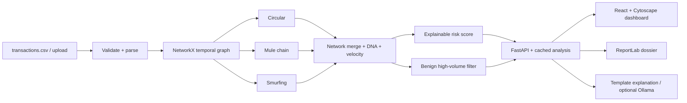

# TRACEFLOW — AI-Powered Financial Crime Network Reconstruction
*Temporal Graph Intelligence for Financial Crime Investigation*

## 1. Problem
AML systems raise alerts, but investigators must still rebuild the story behind each one by hand.

## 2. Solution
TRACEFLOW turns raw transactions into a directed temporal graph, finds suspicious patterns with deterministic
algorithms, and explains them: **raw transactions → hidden network → suspicious pattern → follow the money →
replay → explain why → what-if → dossier**. Output is always a *suspicious pattern / investigation priority /
risk indicator that requires human review* — never a claim of guilt. No paid APIs, no keys, no real data.

## 3. Architecture


## 4. Features
Overview dashboard · Network Explorer (Cytoscape, filters) · Follow the Money · Money-flow Replay ·
Investigation detail (evidence, timeline, Network DNA, accounts) · What-if simulation · AI explanation
(deterministic, optional local LLM) · PDF dossier · CSV upload with validation · 5 demo scenarios.

## 5. Detection algorithms
* **Rapid paths (circular + mule):** time-respecting DFS. A hop = next transaction from the receiving account within
  `max_gap` (600 s) carrying 0.8–1.02× of the previous amount. Closing on the start account = cycle (≤6 hops, ≥3
  accounts); otherwise ≥3 hops = mule chain. Slow, coincidental cycles in normal traffic are not flagged.
* **Smurfing:** ≥5 unique senders to one account within 4 h, tightly clustered amounts (CV ≤ 0.35), senders mostly
  first-time counterparties; follows onward forwarding. One-to-many uses the same test.
* **Benign filter:** repeat counterparties, broad distribution or regular timing/amounts, no circular route, no
  rapid pass-through → "Likely normal high-volume commerce" (contextual, never certain).
* **Velocity:** tx/min, tx/hour, mean/median delay, burst, HIGH/MEDIUM/LOW.
* **Priority score (0–100):** Circularity 30, Velocity 20, Smurfing 20, Cross-bank 10, Structure 10, Timing 10.
  HIGH ≥ 65, MEDIUM ≥ 35. It is a priority, **not** a probability.

## 6. Screenshots
`docs/overview.png` · `docs/explorer.png` · `docs/replay.png` · `docs/case.png` *(add yours)*

## 7. Installation (Windows / VS Code)
Needs Python 3.10+ and Node 18+.
```
cd backend
pip install -r requirements.txt
cd ../frontend
npm install
```

## 8. Running
Easiest: double-click **run.bat**. Or two terminals:
```
cd backend  && uvicorn main:app --reload      # http://127.0.0.1:8000/docs
cd frontend && npm run dev                    # http://localhost:5173
```
Tests: `cd backend && python -m pytest -q tests`. Regenerate data: `python backend/data/generate_data.py`.

## 9. Demo scenarios (header → LOAD DEMO SCENARIO)
1 circular route (A101) · 2 mule chain (A501) · 3 smurfing ring (A700) · 4 normal high-volume commerce (A1086) ·
5 mixed circular + mule (A801). 3-minute flow: Overview → scenario 1 → Replay → Case → Explain → What-if → Dossier.

## 10. Limitations
Synthetic data only; thresholds are tuned for it. Analysis is in-memory (re-run on upload), no auth, no
persistence of case status, rule-based (no learned model). Scores guide human review.

## 11. Future improvements
Learned anomaly scoring, streaming ingestion, persistent case workflow (SQLite), analyst notes, richer
cross-bank entity resolution, Ollama-written narratives, graph embeddings.
